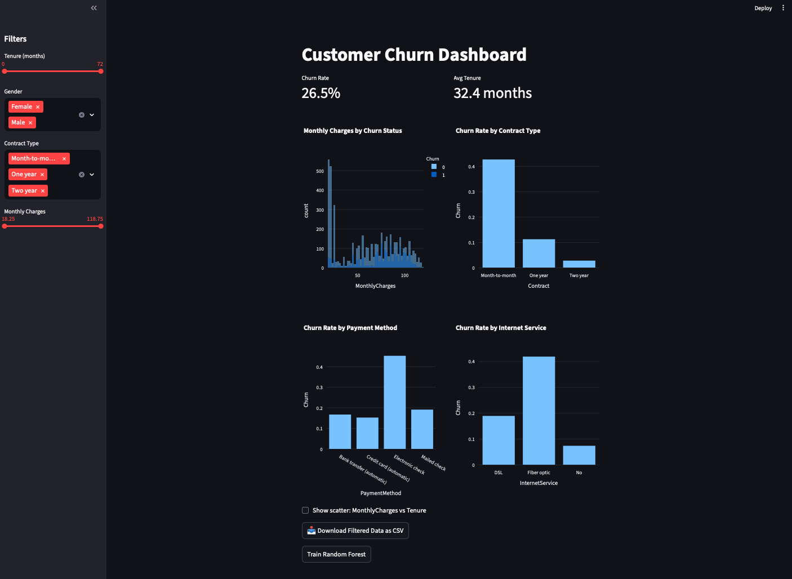
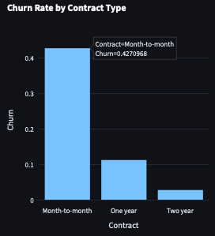
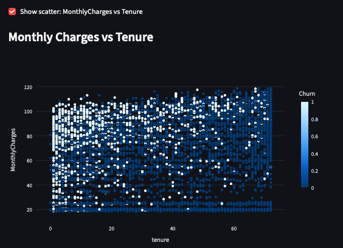
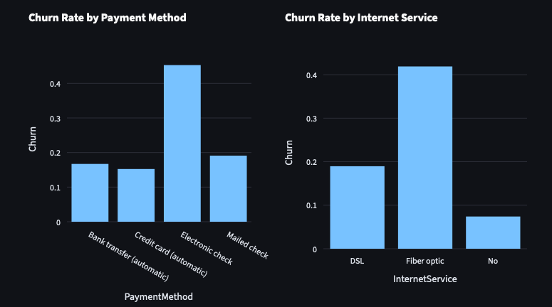
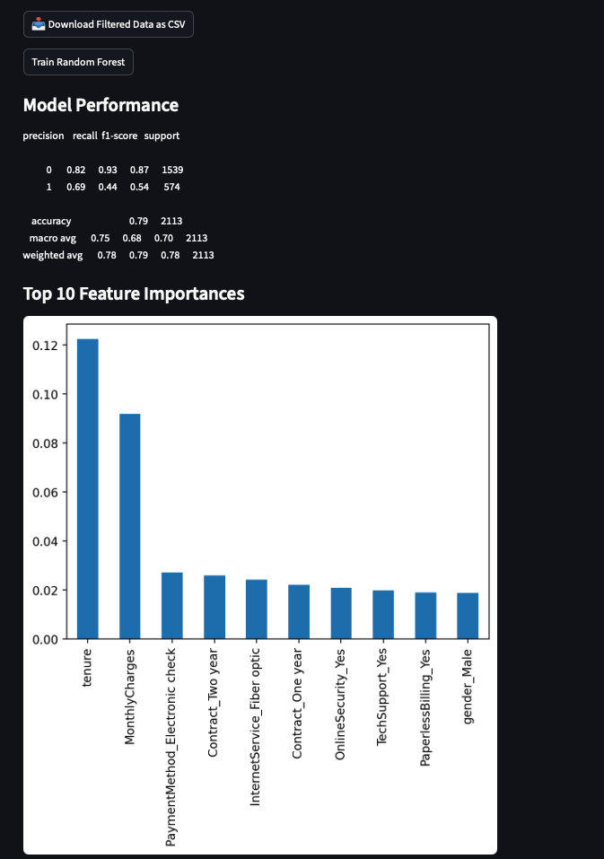

**Customer Churn Dashboard**

An interactive Streamlit app to explore churn patterns in telecom data. Shows churn rates, customer KPIs, visualizations, and a simple ML model (Random Forest) for prediction.

⸻

**Features**
	•	Interactive filters (tenure, charges, gender, contract type).
 
	•	KPIs and churn visualizations.
 
	•	Random Forest churn prediction with feature importance.
 
	•	Downloadable filtered dataset.




⸻

**Quickstart**
```
git clone https://github.com/tgmh4/churn-dashboard.git
cd churn-dashboard
pip install -r requirements.txt
streamlit run app.py
```

**Structure**
```
app.py
requirements.txt
telco_churn.csv
assets/
```

**Next Steps**
•	Add more interactive graphs and advanced filtering options.

•	Deploy live app on Streamlit Cloud.

•	Incorporate additional ML models (Logistic Regression, XGBoost) for comparison.

•	Address class imbalance with resampling or weighted models.

•	Expand insights with customer segmentation analysis.


**Acknowledgements**

Dataset: [Kaggle – Telco Customer Churn](https://www.kaggle.com/datasets/blastchar/telco-customer-churn) 
Inspired by [open-source churn dashboards](https://github.com/topics/churn-prediction) and [Streamlit community projects](https://discuss.streamlit.io/).


⸻

**Initial Insights:**
	•	Contract type (tenure) is the strongest predictor of churn; customers on month-to-month contracts show the highest churn at almost 43%.

    

    •	Monthly charges is the second strongest predictor. This visualization reveals how customers who are paying less tend to be content with their plan and stay with their provider. On the other hand, customers paying over $80 a month churn disproportionately.

    

	•	Automatic payment methods (credit card, bank transfer) are linked with lower churn compared to electronic check.
	•	Internet service type matters: customers on fiber optic plans churn more than DSL customers.

    

    •	Class imbalance exists (fewer churners than non-churners), so precision/recall tradeoffs are important.

	•	The baseline Random Forest achieved ~82% accuracy. Logistic Regression trades some accuracy for greater interpretability.

    


**Future Hypotheses:**
    •	Higher monthly charges increase churn risk, especially when combined with no additional services.

**Recommendations**
    •	Streamline and modernize payment methods.

    •	Retention strategies like longer contracts and bundled services may reduce churn.
